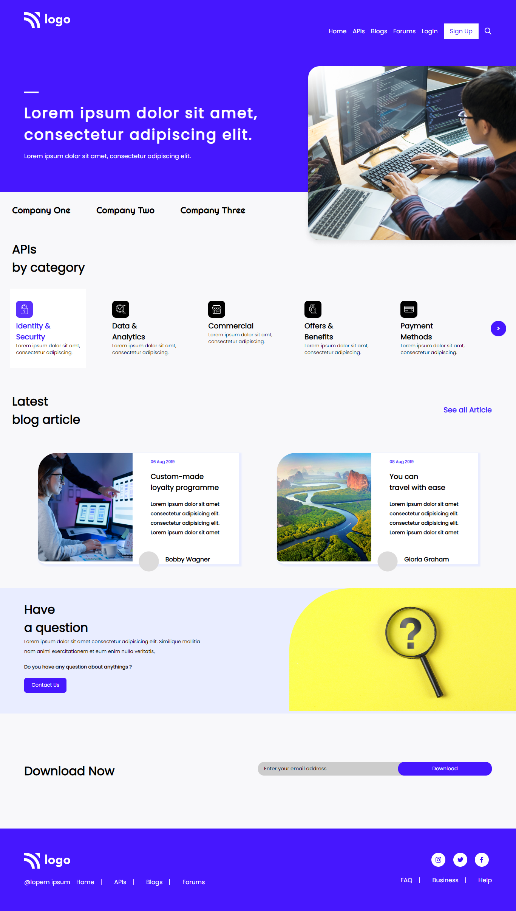

# PRANAV MATHUR

## Learnings from the project:

- Flexbox vs Grid layout, What to choose and when.
- Responsive design

## Time taken:

    It took me 2-3 days understanding where to apply 'flex-wrap' or Grid to layout the webpage.

## Screenshots:

## Live link:

[Go to site](https://developer-landingpage-09.netlify.app/)
